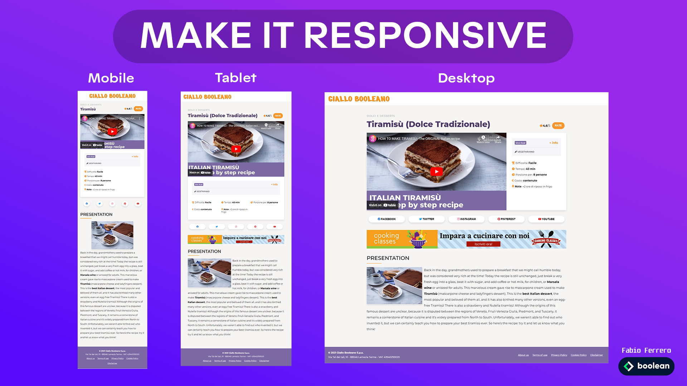

 
Dodicesimo Esercizio Classe #137 - Boolean

---

Studente: Fabio Ferrero

---
# English

## Target of the project:
Use the @media queries in the CSS code to adapt the provided page layout to various display sizes

---
# Italiano

## Obiettivo del progetto:
Utilizzare le @media query nel codice CSS per adattare il layout della pagina fornita alle varie dimensioni di display

---

---

---
<strong>A differenza dell'esercizio precedente, questa volta si parte da un layout Mobile FIRST</strong>